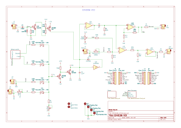

# CD40106 VCO

Saw-core VCO based on Moritz Klein version, with additionnal wave shaping capabilities.

Saw, Square, Sine and triangle wave output.

V/Oct, PWM and FM CV inputs. 

Sync input. 

Octave switch and pot for fine control for each octave

Extension connector to connect to the SubPhatty extender (Sub octave extender, soon to be released)

## Schematics

## BoM

[See bom](documentation/bom/CD40106_VCO_V1.0--iBoM.html)

You have a bom in excel format available in the bom folder. 

## Build Informations

Uses an SMD LM13700 because the DIP ones are not produced anymore.

Regular build, I use ceramic capacitors but you can use film/polyester.

Polyester capacitor for the saw core. 

:warning: When building modules, always do it in this order (from smallest component to highest):
- diodes
- resistors
- DIP chips
- capacitors (film/ceramic)
- Transistors
- Electrolytic capacitors

To solder the headers, place them and place both PCBs in their final position before fully soldering the pin headers/sockets.

For the next parts, always place them without soldering them on: 
- jacks, pots and switches that go throught the front panel

Once placed, put the front panel in place, then fasten all components to it. Once this is done, you can solder all the remaining components.

